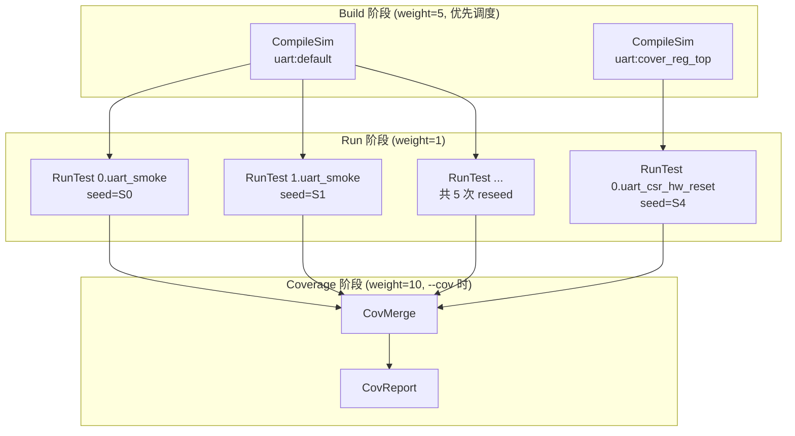

# DVSim 设计报告

**版本**：v1.49.12
**定位**：面向 ASIC 项目的 EDA 工具流程编排系统（build & run system），用 Python 编写，以 Hjson 配置驱动，工具无关。

---

## 目录

- [一、设计目标](#一设计目标)
- [二、整体架构](#二整体架构)
- [三、核心设计原则](#三核心设计原则)
  - [3.1 配置驱动：Hjson + 通配符展开](#31-配置驱动hjson--通配符展开)
    - [3.1.1 `import_cfgs` — 字段级叠加合并](#311-import_cfgs--字段级叠加合并)
    - [3.1.2 `use_cfgs` — 配置级聚合（primary 配置）](#312-use_cfgs--配置级聚合primary-配置)
    - [3.1.3 `import_cfgs` 与 `use_cfgs` 对比](#313-import_cfgs-与-use_cfgs-对比)
  - [3.2 配置选型与合并原则（重点）](#32-配置选型与合并原则重点)
    - [3.2.1 示例：`reseed` 的多路径叠加处理](#321-示例reseed-的多路径叠加处理)
  - [3.3 工具无关性](#33-工具无关性)
  - [3.4 模式抽象：build_modes / run_modes / tests / regressions](#34-模式抽象build_modes--run_modes--tests--regressions)
  - [3.5 并行调度与资源管理](#35-并行调度与资源管理)
    - [3.5.1 Sim 流程的 Job DAG（build → run → cov）](#351-sim-流程的-job-dagbuild--run--cov)
    - [3.5.2 Scheduler 六态状态机](#352-scheduler-六态状态机)
    - [3.5.3 LSF 管理全过程（结合 build / run job）](#353-lsf-管理全过程结合-build--run-job)
    - [3.5.4 Build 与 Run 在 LSF 上的时序关系](#354-build-与-run-在-lsf-上的时序关系)
    - [3.5.5 资源管理与命令行](#355-资源管理与命令行)
  - [3.6 测试计划驱动](#36-测试计划驱动)
  - [3.7 可观测性](#37-可观测性)
  - [3.8 可扩展性](#38-可扩展性)
- [四、功能与使用指南](#四功能与使用指南)
  - [4.1 基本调用](#41-基本调用)
  - [4.2 配置文件编写](#42-配置文件编写)
    - [4.2.1 `ral_spec` — RAL 规范文件及其生成全过程](#421-ral_spec--ral-规范文件及其生成全过程)
    - [4.2.2 `build_modes` — 编译模式](#422-build_modes--编译模式)
    - [4.2.3 `run_modes` — 运行模式](#423-run_modes--运行模式)
    - [4.2.4 `regressions` — 回归集](#424-regressions--回归集)
  - [4.3 常用选项分组](#43-常用选项分组)
  - [4.4 配置选型调试技巧](#44-配置选型调试技巧)
  - [4.5 冲突处理约定（重要）](#45-冲突处理约定重要)
- [五、设计取舍小结](#五设计取舍小结)
- [附录 A：DVSim 命令行选项完整清单](#附录-advsim-命令行选项完整清单)

---

## 一、设计目标

DVSim 旨在用**单一标准化命令行接口**封装 EDA 工具流程的多个步骤（编译、运行、覆盖率、报告），解决以下痛点：

1. 多种 EDA 工具（VCS/Xcelium/Questa/Riviera/Verilator/Dsim/DC/Ascentlint…）命令差异大；
2. 单次回归涉及大量并行 build/run，需依赖管理与负载均衡；
3. 配置分散、可复用性差、难以追溯。

设计哲学：**配置驱动、工具无关、声明式优先、冲突显式报错而非静默覆盖**。

---

## 二、整体架构

DVSim 采用分层流水线设计，从上到下依次为：

```
CLI (cli/run.py)
  └─ FlowCfg (flow/base.py)  ── 配置加载/合并/展开/重载
       └─ Flow 子类 (sim/flow.py, flow/{formal,lint,syn,one_shot}.py)
            └─ 创建 Deploy 对象 (job/deploy.py: CompileSim/RunTest/CovReport…)
                 └─ Scheduler (scheduler/core.py)  ── asyncio DAG 调度
                      └─ Launcher (launcher/{local,lsf,slurm,nc}.py)  ── 作业分发
                           └─ Tool 插件 (tool/*.py)  ── EDA 工具命令组装
```

**支持流程**：`sim`（两阶段 build→run）、`formal`/`lint`/`syn`/`cdc`/`rdc`（单次构建 OneShotCfg）。工厂 `flow/factory.py` 依据 Hjson 的 `flow` 字段选择子类。

---

## 三、核心设计原则

### 3.1 配置驱动：Hjson + 通配符展开

- **配置格式**：Hjson（`utils/hjson.py:16-34` 解析），支持注释、引号省略，便于人工维护。
- **包含机制**：`import_cfgs` 与 `use_cfgs` 两种包含方式，由 `flow/hjson.py:14-52 load_hjson` 以 worklist + seen 集合广度加载，**自动防环**（`hjson.py:39-47`）。二者语义不同，详见下文。

#### 3.1.1 `import_cfgs` — 字段级叠加合并

**语义**：把指定文件的字段**合并到当前这一个配置对象**（同一个 `FlowCfg` 实例）。机制上是通用字段合并，但**主要用途是导入可复用的 testlist（测试列表）片段**——每个 testlist 文件通常打包一组相关的 `tests`，以及配套的 `build_modes`、`run_modes`、`regressions` 定义，供多个 IP 的 sim_cfg 按需叠加引用。

**典型导入内容**：

| 类别 | 常见字段 | 说明 |
|---|---|---|
| 公共基础设施 | `flow`、`build_opts`、`run_opts`、`regressions`（smoke/all/nightly） | 如 `common_sim_cfg.hjson`，提供工具链默认与全局 regression |
| **testlist 片段** | `tests` | 一组可复用测试定义（`{name}` 通配符在展开时替换为 IP 名） |
| testlist 配套 | `build_modes` | 测试依赖的编译模式（如 `cover_reg_top`） |
| testlist 配套 | `run_modes` | 测试依赖的运行模式（如 `csr_tests_mode`） |
| testlist 配套 | `regressions` | 将上述 tests 分组为 `smoke`、`sw_access` 等 regression 目标 |

testlist 文件本身也可再 `import_cfgs` 其他 testlist（如 `stress_tests.hjson` 导入 `stress_all_test.hjson`），形成分层复用。

**使用规则**：

| 规则 | 说明 | 代码位置 |
|---|---|---|
| 语法 | `import_cfgs: ["path1", "path2", ...]`，值为字符串列表 | `hjson.py:75-82` |
| 加载顺序 | worklist 广度优先，按列表顺序依次加载导入文件 | `hjson.py:36-50` |
| 字段合并 | 走 `set_target_attribute`：list 拼接、标量按默认值取舍、冲突报错 | `hjson.py:104` |
| 路径通配符 | 导入路径支持 `{var}` 替换（如 `{proj_root}`） | `hjson.py:107-110` |
| 防环 | seen 集合记录已加载路径，重复出现即抛 `RuntimeError` | `hjson.py:39-47` |
| 出现位置 | 可在任意层级的文件中出现（顶层或被导入文件中均可再嵌套） | — |
| 去重 | 导入文件中的 `import_cfgs` 自身也会被递归展开 | `hjson.py:81` |

**举例 1**：IP sim_cfg 叠加公共配置与多个 testlist

```hjson
// hw/ip/uart/dv/uart_sim_cfg.hjson
{
  name: uart
  tool: vcs
  build_opts: ["+define+UART_DBG"]

  // 公共基础设施 + 可复用 testlist 片段
  import_cfgs: [
    "{proj_root}/hw/dv/tools/dvsim/common_sim_cfg.hjson",
    "{proj_root}/hw/dv/tools/dvsim/tests/csr_tests.hjson",
    "{proj_root}/hw/dv/tools/dvsim/tests/intr_test.hjson",
    "{proj_root}/hw/dv/tools/dvsim/tests/alert_test.hjson"
  ]

  // IP 专属测试追加到已导入的 tests 列表末尾
  tests: [{ name: uart_smoke, uvm_test_seq: uart_smoke_vseq }]
}
```

**举例 2**：testlist 文件内容（`tools/dvsim/tests/csr_tests.hjson`）

```hjson
{
  build_modes: [{ name: cover_reg_top }]

  run_modes: [{
    name: csr_tests_mode
    uvm_test_seq: "{name}_common_vseq"
    run_opts: ["+en_scb=0"]
  }]

  tests: [{
    name: "{name}_csr_hw_reset"
    build_mode: "cover_reg_top"
    en_run_modes: ["csr_tests_mode"]
    reseed: 1
  }, {
    name: "{name}_csr_rw"
    build_mode: "cover_reg_top"
    en_run_modes: ["csr_tests_mode"]
    reseed: 5
  }]

  regressions: [{
    name: smoke
    tests: ["{name}_csr_hw_reset", "{name}_csr_rw"]
  }, {
    name: sw_access
    tests: ["{name}_csr_hw_reset", "{name}_csr_rw", ...]
  }]
}
```

导入后，`{name}` 在通配符展开阶段替换为 `uart`，生成 `uart_csr_hw_reset`、`uart_csr_rw` 等测试名。

**合并效果**（以 `csr_tests.hjson` + IP 本地 `build_opts` 为例）：

```
最终 tests       = [uart_smoke]           (IP 本地)
                 + [{name}_csr_hw_reset, {name}_csr_rw, ...]  (testlist，list 拼接)
                 + [{name}_intr_test, ...]                     (其他 testlist)

最终 build_modes = []                   (common 默认)
                 + [cover_reg_top]       (csr_tests)
                 + [cover_reg_top]       (intr_test，同名 mode 后续走路径 B merge_mode 合并)

最终 regressions = [smoke, all, nightly] (common)
                 + [smoke, sw_access]    (csr_tests，list 拼接；同名 regression 走路径 B 合并)

最终 build_opts  = ["+define+UART_DBG"]  (IP 本地)
                 + ["+define+UVM", ...]  (common，list 拼接)
```

> **要点**：`import_cfgs` 对 list 字段（`tests`、`build_modes`、`run_modes`、`regressions`）做**拼接**；同名 mode/regression 的字段级合并走路径 B（`merge_mode`，见 3.2）。IP sim_cfg 只需写 IP 专属 tests，通用 CSR/中断/告警等测试通过 import testlist 获得。

#### 3.1.2 `use_cfgs` — 配置级聚合（primary 配置）

**语义**：声明当前文件是一个 **primary 配置**，并列出若干**互相独立的子配置**。每个子配置各自构建独立的 `FlowCfg` 实例，字段互不合并；primary 仅在最后汇总它们的 deploy 对象统一调度。

**使用规则**：

| 规则 | 说明 | 代码位置 |
|---|---|---|
| 语法 | `use_cfgs: ["path1", {name:..., ...}, ...]`，支持文件路径**或内联 dict** | `base.py:152-153` |
| 标识 primary | 文件中含 `use_cfgs` 即判定为 primary 配置 | `base.py:147` |
| 独立性 | 每个子配置是独立 `FlowCfg`，字段不互相合并 | `base.py:149-153` |
| 仅限顶层 | 只能在**第一个被加载的（顶层）文件**中定义；被 `import_cfgs` 导入的文件若含 `use_cfgs` 会报错 | `hjson.py:91-101` |
| 子配置加载 | 通过 `_load_child_cfg` 加载，内联 dict 会转成临时 hjson 文件 | `base.py:152-153` |
| 选择性运行 | `--select-cfgs` 可过滤要运行的子配置 | `cli/run.py:401-411` |
| 汇总调度 | primary 汇总所有子配置的 deploy 列表统一交给调度器 | `base.py:149-150` |

**举例 1**：primary 配置聚合多个 IP 的仿真

```hjson
// hw/top_earlgrey/dv/primary_sim_cfg.hjson（primary 配置）
{
  name: top_earlgrey
  flow: sim

  // 每个子配置独立加载，各自有自己的 tool/tests/build_modes
  use_cfgs: ["{proj_root}/hw/ip/uart/dv/uart_sim_cfg.hjson",
             "{proj_root}/hw/ip/spi_host/dv/spi_host_sim_cfg.hjson",
             {name: aes_variant, tool: vcs, tests: [{name: aes_smoke}]}]
}
```

运行方式：

```bash
# 运行所有子配置
dvsim hw/top_earlgrey/dv/primary_sim_cfg.hjson -i smoke

# 仅运行 uart 子配置
dvsim hw/top_earlgrey/dv/primary_sim_cfg.hjson -i smoke --select-cfgs uart
```

**举例 2**：内联 dict 子配置（无需独立文件）

```hjson
{
  name: my_chip
  flow: sim
  use_cfgs: [
    {name: fast_test, tool: verilator, reseed: 1, tests: [{name: smoke}]}
  ]
}
```

#### 3.1.3 `import_cfgs` 与 `use_cfgs` 对比

| 维度 | `import_cfgs` | `use_cfgs` |
|---|---|---|
| 合并粒度 | 字段级（多文件 → 一个配置对象） | 配置级（多个独立配置 → primary 汇总） |
| 字段是否互相合并 | 是（list 拼接、标量取舍） | 否（各子配置独立） |
| 出现位置 | 任意层级文件 | 仅顶层（第一个）文件 |
| 典型用途 | 复用公共 build_opts/run_opts/模式定义 | 一次回归聚合多个 IP/变体的独立仿真 |
| 冲突处理 | 走 `set_target_attribute` 规则 | 各自独立，无字段冲突 |
| 选择性运行 | 不适用（已合并） | `--select-cfgs` 过滤 |
- **通配符替换**：`{var}` 形式在合并后统一展开（`flow/base.py:206-214 _expand` → `utils/wildcards.py find_and_substitute_wildcards`），primary 配置允许部分未展开。
- **命令行优先**：`tool` 等 `_CMDLINE_FIELDS`（`hjson.py:11`）字段若由命令行设定，则忽略 Hjson 中的同名值。

### 3.2 配置选型与合并原则（重点）

这是 DVSim 最核心、也最易误解的设计。一个选项可在**配置文件、import 链、mode、CLI** 多处赋值。DVSim 用**三条独立路径**处理，遵循统一规则：**列表拼接、标量"默认值让位非默认值"、冲突即报错**。

#### 路径 A：`import_cfgs` 顶层字段合并 —— `set_target_attribute`（`flow/hjson.py:113-190`）

处理被导入的多份 Hjson 中**同名顶层字段**。规则：

| 旧值 / 新值类型 | 处理方式 | 代码位置 |
|---|---|---|
| 旧值为 `None` | 直接写入新值 | `hjson.py:121-125` |
| 都是 `list` | **拼接** `target[key] += dict_val` | `hjson.py:138-140` |
| 都是标量且相等 | 跳过 | `hjson.py:166-167` |
| 标量，新值是默认值（`str:""`/`int:0,-1`/`bool:False`） | 跳过（默认值不覆盖） | `hjson.py:174-175` |
| 标量，旧值是默认值、新值非默认 | 新值覆盖旧值 | `hjson.py:179-181` |
| 标量，都非默认且不等 | **抛 RuntimeError（冲突）** | `hjson.py:183-190` |

> 设计原则：**默认值是"占位"，任何明确的非默认值都胜出；两个明确值冲突说明配置矛盾，必须人工介入，绝不静默取舍。**

#### 路径 B：同名 Mode 合并 —— `merge_mode`（`modes.py:52-149`）

`build_mode`/`run_mode`/`test`/`regression` 同名定义出现在多文件时，由 `create_modes`（`modes.py:151-222`）两遍处理：Pass1 合并同名、Pass2 递归展开 sub_modes。合并规则与路径 A 一致（list 追加、标量按默认值取舍、冲突 `log.error` 退出，见 `modes.py:128-137`）。sub_mode 通过 `en_build_modes`/`en_run_modes` 表达依赖，并做**循环依赖检测**（`modes.py:169-171`）。

#### 路径 C：显式重载 `overrides` —— `_do_override`（`flow/base.py:321-378`）

Hjson 中可声明 `overrides: [{name: ..., value: ...}, ...]` 列表，在通配符展开**之前**强制覆盖（`base.py:160-161`）。规则：

- 必须命中已存在属性，否则报错（`base.py:376-378`）；
- 类型必须兼容，否则报错（`base.py:368-375`）；
- 同一 key 重复 override 直接报错（`base.py:344-350`）；
- 覆盖过程用 `log.debug` 打印（`base.py:365`）。

#### 优先级总览

```
命令行参数 (--tool 等)  >  overrides (显式重载)  >  mode 合并 (路径B)  >  import_cfgs 字段合并 (路径A)
```

CLI `--tool` 最高；`overrides` 次之且最强制；其后是 mode 内合并；最后是 import 链的顶层字段。**所有冲突均显式报错，无隐式优先级。**

> ⚠️ **可观测性现状**：仅路径 C（overrides）通过 `log.debug` 打印选择过程；路径 A、B 正常合并是**静默**的，仅冲突时报错。调试配置合并需用 `--verbose=debug`（`cli/run.py:851-864, 937-938`）。

#### 3.2.1 示例：`reseed` 的多路径叠加处理

`reseed`（每个测试的重跑次数）是最典型的"多路径赋值"字段。它可在 **四个层级** 分别设置，且 **regression 的影响分配置阶段与运行阶段两步**：

| 层级 | 设置位置 | 合并路径 | 生效时机 |
|---|---|---|---|
| sim_cfg 顶层 | `reseed: N` | 路径 A（import 合并）→ 路径 C（overrides） | 配置加载时 |
| test 字典 | `tests: [{ name: ..., reseed: N }]` | 路径 B（test 构造 + 回填） | `_create_objects` 时 |
| regression 字典 | `regressions: [{ name: ..., reseed: N }]` | 路径 B（同名 regression `merge_mode`） | `_create_objects` 时合并定义；**`-i` 选中该 regression 时**才覆盖 test |
| 命令行 | `--reseed` / `--reseed-multiplier` | 最高优先级 | `_create_build_and_run_list` 时 |

下面用 `uart` 配置演示完整叠加过程，重点说明 **regression 设置**。

**处理链路（配置阶段 → 运行阶段，从低到高）**：

```
① sim_cfg.reseed (顶层 / import_cfgs 合并)              路径 A
  ↓ _process_overrides
② overrides 重载 sim_cfg.reseed                         路径 C
  ↓ Test 构造 + sim_cfg 回填
③ test 字典 reseed → Test 对象                          路径 B（test.py:80-93）
  ↓ Regression.create_regressions + 同名 merge_mode
④ regression 字典 reseed → Regression 对象（合并定义）   路径 B（regression.py:45-75, modes.py:52-137）
  ↓ -i 选中 regression 时 merge_regression_opts
⑤ regression.reseed 覆盖该 regression 下 test.reseed    运行阶段（regression.py:177-179）
  ↓ 命令行
⑥ --reseed N                                            (sim/flow.py:429-430)
  ↓
⑦ --reseed-multiplier X                                 (sim/flow.py:435-436)
```

> **regression 关键语义**：
> - 步骤 ④ 仅把各文件中的 regression 定义**合并为一个 Regression 对象**（同名 `merge_mode`），此时 `reseed` 按标量规则合并，但**尚未改写任何 test**。
> - 步骤 ⑤ 仅在 **`-i` 选中该 regression** 时触发（`sim/flow.py:378-396`）。直接 `-i uart_smoke` 选单个 test **不经过** regression，regression 的 `reseed` **不生效**。
> - regression 的 `reseed` 一旦在步骤 ⑤ 生效，会**无条件覆盖**其下所有 test 的 reseed（抹平 test 级差异）。

**场景设定**：

```hjson
// uart_sim_cfg.hjson
{
  name: uart
  reseed: 10
  import_cfgs: [
    ".../common_sim_cfg.hjson",
    ".../tests/csr_tests.hjson"
  ]
  overrides: [{ name: reseed, value: 5 }]
  tests: [
    { name: uart_smoke },
    { name: uart_fifo_reset, reseed: 200 }
  ]
}
```

相关 import 文件中的 regression / test 定义：

```hjson
// common_sim_cfg.hjson
regressions: [
  { name: smoke,  tests: [], reseed: 1, run_opts: ["+smoke_test=1"] }
  { name: all }
  { name: all_once, reseed: 1 }
  { name: nightly, en_sim_modes: ["cov"] }
]

// csr_tests.hjson（展开后 {name} → uart）
regressions: [
  { name: smoke,     tests: ["uart_csr_hw_reset", "uart_csr_rw"] }
  { name: sw_access, tests: ["uart_csr_hw_reset", "uart_csr_rw", ...] }
]
tests: [
  { name: uart_csr_hw_reset, reseed: 1 }
  { name: uart_csr_rw,       reseed: 5 }
  ...
]
```

**逐步演算**：

**步骤 1 — import_cfgs 合并顶层 reseed（链路 ①，路径 A）**
- `common` 无顶层 reseed → 不影响
- `uart` 的 `reseed: 10` → `sim_cfg.reseed = 10`

**步骤 1b — overrides 重载顶层 reseed（链路 ②，路径 C）**
- `overrides: [{ name: reseed, value: 5 }]` → `sim_cfg.reseed = 5`

**步骤 2–3 — Test 构造与回填（链路 ③，路径 B）**

| test | test 字典 reseed | 回填后 reseed | 来源 |
|---|---|---|---|
| uart_smoke | 未设 | 5 | sim_cfg 顶层（经 overrides） |
| uart_fifo_reset | 200 | 200 | test 显式值 |
| uart_csr_hw_reset | 1 | 1 | test 显式值 |
| uart_csr_rw | 5 | 5 | test 显式值 |

**步骤 4 — regression 对象创建与同名合并（链路 ④，路径 B）**

`Regression.create_regressions` 对 import 链中**同名 regression** 做 `merge_mode`（与 test 合并规则相同）：

| regression | 来源 | reseed | tests |
|---|---|---|---|
| `smoke` | common | 1 | `[]` |
| `smoke` | csr_tests | 未设（None） | `[uart_csr_hw_reset, uart_csr_rw]` |
| **合并后 `smoke`** | — | **1** | `[uart_csr_hw_reset, uart_csr_rw]` |
| `sw_access` | csr_tests | 未设 | `[uart_csr_hw_reset, uart_csr_rw, ...]` |
| `all` | common | 未设 | `None`（表示跑全部 test） |
| `all_once` | common | 1 | `None` |
| `nightly` | common | 未设 | `None` |

合并细节（以 `smoke` 为例）：
- `reseed`：common 设 1，csr_tests 未设 → 保留 1（`modes.py:77` 跳过 None）
- `tests`：list 拼接 `[] + [uart_csr_hw_reset, uart_csr_rw]` → 最终仅含 CSR 两个 test（`uart_smoke` **不在** smoke regression 内）
- `run_opts`：common 的 `["+smoke_test=1"]` 保留，选中 smoke 时附加到各 test

⚠️ 若两个文件对同名 regression 都设了不同的非默认 `reseed`（如 common: 1、IP: 5），`merge_mode` 会**冲突报错**（`modes.py:128-137`）。

**步骤 5 — 选定 regression 时覆盖 test.reseed（链路 ⑤，运行阶段）**

`merge_regression_opts`（`regression.py:177-179`）仅在 regression 被 `-i` 选中后执行：

```python
if self.reseed is not None:
    test.reseed = self.reseed
```

不同 `-i` 选择的效果（步骤 2–3 之后、无命令行 `--reseed`）：

| `-i` 选择 | 涉及 test | 步骤 ⑤ 后 reseed | 说明 |
|---|---|---|---|
| `uart_smoke` | uart_smoke | 5 | 直接选 test，**不经过** regression，regression reseed 不生效 |
| `uart_fifo_reset` | uart_fifo_reset | 200 | 同上 |
| `smoke` | uart_csr_hw_reset, uart_csr_rw | **1, 1** | smoke regression `reseed: 1` 覆盖 test 级 1/5 |
| `sw_access` | uart_csr_hw_reset, uart_csr_rw, ... | 1, 5, ... | sw_access **无** regression reseed，保留各 test 自身值 |
| `all` | 全部 test | 5, 200, 1, 5, ... | all **无** regression reseed，保留各 test 自身值 |
| `all_once` | 全部 test | **1, 1, 1, 1, ...** | all_once `reseed: 1` 强制全部单次 |

**步骤 6 — 命令行 `--reseed 5`（链路 ⑥）**

无条件覆盖 run_list 中**所有** test，无论其来自 regression 还是直接选取。

**步骤 7 — 命令行 `--reseed-multiplier 3`（链路 ⑦）**

在步骤 6 结果上按比例放大（保底 1）。

**最终结果汇总**（代表性组合）：

| 命令行 / 条件 | uart_smoke | uart_csr_rw | 说明 |
|---|---|---|---|
| `-i uart_smoke` | 5 | — | 不跑 csr；regression reseed 不介入 |
| `-i smoke` | — | 1 | smoke regression 覆盖 csr test reseed |
| `-i sw_access` | — | 5 | 无 regression reseed，保留 test 级值 |
| `-i all_once` | 1 | 1 | all_once 强制全部 reseed=1 |
| `-i smoke --reseed-multiplier 3` | — | 3 | smoke 先压到 1，再 ×3 |
| `-i all --reseed-multiplier 3` | 15 | 15 | 保留各 test 比例（5/200/1/5…）再放大 |
| `--fixed-seed 123` | 1 | 1 | 隐含 `--reseed 1`（`cli/run.py:971-972`） |

**regression 与 reseed 的典型配置模式**：

```hjson
// 模式 1：smoke 快速回归 — 强制所有 test 只跑 1 次
{ name: smoke, tests: [...], reseed: 1, run_opts: ["+smoke_test=1"] }

// 模式 2：all_once 全量单次 — 所有 test 各跑 1 次
{ name: all_once, reseed: 1 }    // tests 缺省为 None → 跑全部

// 模式 3：按 test 自身 reseed 跑 — regression 不设 reseed
{ name: sw_access, tests: ["uart_csr_hw_reset", "uart_csr_rw", ...] }
// uart_csr_hw_reset reseed:1, uart_csr_rw reseed:5 各自保留

// 模式 4：testlist 与 common 共建 smoke — 同名 merge_mode 合并
// common: { name: smoke, reseed: 1, tests: [] }
// csr_tests: { name: smoke, tests: ["uart_csr_hw_reset", "uart_csr_rw"] }
// → 合并后 smoke 继承 reseed:1 + csr 的 tests 列表
```

**关键要点**：

- `reseed` 可在 sim_cfg 顶层、test 字典、regression 字典三处配置；`overrides`（路径 C）**仅能改写 sim_cfg 顶层**。
- **test 级显式值**优先于 sim_cfg 顶层回填（`test.py:84`）；但 **regression 级 reseed 在 `-i` 选中时覆盖 test 级**（`regression.py:177-179`）。
- regression 的 reseed 配置分两步：**配置阶段**同名合并（路径 B `merge_mode`），**运行阶段**选中才覆盖 test（`merge_regression_opts`）。
- 直接 `-i <test_name>` 不触发 regression 逻辑，test 保留步骤 2–3 的 reseed。
- `common_sim_cfg.hjson` 中 `smoke`（`reseed: 1`）和 `all_once`（`reseed: 1`）是项目级快速/单次回归约定；testlist 中的 regression（如 `sw_access`）通常不设 reseed，保留各 test 的独立运行次数。
- `--reseed` 最终无条件覆盖一切配置层级的 reseed；`--reseed-multiplier` 在最终值上按比例放大。

### 3.3 工具无关性

- 仿真器/工具通过 `tool/` 下的插件适配（`get_sim_tool_plugin`），每个插件提供 `build_opts`/`run_opts` 组装、覆盖率指标解析、波形格式支持等。
- 配置中用 `tool: vcs` 选择，命令行 `--tool` 可覆盖；`{tool}.hjson` 提供工具级默认参数。
- `is_equivalent_job`（`sim/flow.py:493`）做 build 去重——不同 build_mode 若在当前开关下（如未开 coverage）等价则合并，节省算力。

### 3.4 模式抽象：build_modes / run_modes / tests / regressions

- **BuildMode**（`modes.py:258-290`）：编译期选项集合（`build_opts`/`pre_build_cmds`…），含 sub-mode 依赖。
- **RunMode**（`modes.py:293-326`）：运行期选项集合。
- **Test**：引用一个 `build_mode` + `run_mode`，可设 `reseed`。
- **Regression**：test 的分组，可叠加 `en_sim_modes`/`en_build_modes`。

CLI `--items` 支持 glob 匹配（`sim/flow.py:368-376`），同时匹配 regression 与 test。`_expand_run_list`（`sim/flow.py:443-466`）按 reseed 交错排列，**最大化早期覆盖**（A/B reseed 5/2 → ABABAAA）。

### 3.5 并行调度与资源管理

DVSim 的并行执行分两层：**Scheduler**（`scheduler/core.py`）在 Python 进程内维护 DAG 依赖与就绪队列；**Launcher/Backend**（`launcher/lsf.py` 等）负责把就绪 job 真正提交到 LSF 集群。`--remote` 时先把 repo 复制到 scratch，再通过 `DVSIM_BACKEND=lsf`（或 `DVSIM_LAUNCHER=lsf`）选用 LSF 后端。

#### 3.5.1 Sim 流程的 Job DAG（build → run → cov）

一次典型 sim 回归（`sim/flow.py:468-565`）会生成如下 Deploy 对象并转为 `JobSpec` DAG：

| 阶段 | Deploy 类 | `target` | `weight` | 依赖 | `needs_all_deps_pass` |
|---|---|---|---|---|---|
| 编译 | `CompileSim` | `build` | 5 | 无 | — |
| 仿真 | `RunTest` | `run` | 1 | 对应 `CompileSim` | `True`（默认） |
| 覆盖率合并 | `CovMerge` | `cov_merge` | 10 | 全部 `RunTest` | `False`（任一 run 通过即可） |
| 覆盖率报告 | `CovReport` | `cov_report` | 10 | `CovMerge` | `True`（默认） |

**举例**：`uart` IP，`default` 与 `cover_reg_top` 两个 build_mode；`-i smoke` 含 `uart_smoke`（reseed=5）和 `uart_csr_hw_reset`（reseed=1）：



要点：
- 每个 **build_mode** 对应一个 `CompileSim`；等价 build 会去重（`sim/flow.py:491-501`）。
- 每个 **(test, reseed_index)** 对应一个 `RunTest`，`dependencies` 指向其 build_mode 的 `CompileSim`（`deploy.py:688-689`）。
- `RunTest.qual_name` 形如 `0.uart_smoke.<seed>`（`deploy.py:744`），用于区分同 test 多次 reseed。
- build 失败 → 依赖它的 run 被 **Killed**（`needs_all_dependencies_passing=True`）；`CovMerge` 只要有一个 run 通过就会执行。

#### 3.5.2 Scheduler 六态状态机

Scheduler 基于 asyncio 事件驱动（`scheduler/core.py`），每个 job 经历：

```
S (Scheduled)  等待上游依赖完成
  ↓ 依赖满足 (_mark_job_ready)
Q (Queued)     在就绪堆中，等待槽位 / 资源 / backend 并发额度
  ↓ 选中并 submit_many (_mark_job_running)
R (Running)    已提交到 backend，远端或本地执行中
  ↓ poll 完成
P / F / K      Passed / Failed / Killed（终态）
```

就绪堆排序（`scheduler/runner.py:108-112`）：**weight 高者优先** → timeout 大者优先 → dependents 多者优先。因此 build（weight=5）通常先于 run（weight=1）出队，cov（weight=10）最后执行。

并发限制三层叠加（`_schedule_ready_jobs`，`core.py:553-603`）：

| 层级 | 控制项 | 说明 |
|---|---|---|
| Scheduler | `--max-parallel` / `max_parallelism` | 全局同时在跑的 job 上限 |
| Backend | `LsfLauncher.max_parallel` | LSF 后端并发提交上限（与 `--max-parallel` 同步设置） |
| Resource | `-R VCS=30` 等 | 按 license/资源名限制并行（`scheduler/resources.py`） |

每个 job 默认申请 `{TOOL.upper(): 1}` 资源（如 `VCS: 1`，`deploy.py:240-244`），与 `-R` 配合使用。

#### 3.5.3 LSF 管理全过程（结合 build / run job）

LSF 后端通过 `LegacyLauncherAdapter`（`runtime/legacy.py`）接入 Scheduler：Scheduler 调用 `submit_many` → 每个 job 创建一个 `LsfLauncher` → 后台 poller 周期性 `poll()` 直到终态。

**LSF Job Array 分组规则**（`deploy.py:267, 505, 746`）：

| 阶段 | `job_name` 格式 | 示例 | 含义 |
|---|---|---|---|
| Build | `{scratch}_build_{build_mode}` | `uart_20250707_build_default` | 同 build_mode 的 CompileSim 合并为一个 array |
| Run | `{scratch}_run_{build_mode}` | `uart_20250707_run_default` | 同 build_mode 下所有 RunTest 合并为一个 array |
| Cov | `{scratch}_cov_merge` / `_cov_report` | 各一个 array | 通常每 cfg 仅 1 个 job |

**完整 LSF 提交流程**（以 `uart_20250707_run_default` array 含 5 个 RunTest 为例）：

```mermaid
sequenceDiagram
    participant SCH as Scheduler<br/>(core.py)
    participant ADP as LegacyLauncherAdapter<br/>(runtime/legacy.py)
    participant LSF as LsfLauncher<br/>(launcher/lsf.py)
    participant CLU as LSF Cluster<br/>(bsub/bkill)

    Note over SCH: Build 阶段：CompileSim 依赖为空，优先入队
    SCH->>ADP: submit_many([build_job])
    ADP->>LSF: LsfLauncher(build_job)<br/>index=1, job_total=1
    LSF->>LSF: make_job_script()<br/>scratch/lsf/{ts}/uart_*_build_default
    LSF->>CLU: bsub -P {project} -J uart_*_build_default[1-1]<br/>-R rusage[vcssim=1,...]<br/>bash script $LSB_JOBINDEX
    CLU-->>LSF: Job ID
    loop poll_freq=1s
        ADP->>LSF: poll()
        LSF->>LSF: 读 {script}.1.out 判断 exit code
    end
    LSF-->>SCH: PASSED → 解除 RunTest 依赖

    Note over SCH: Run 阶段：5 个 RunTest 在同一 submit_many 批次内累积
    SCH->>ADP: submit_many([run_job_1..5])
    ADP->>LSF: LsfLauncher ×5<br/>index=1..5, 前 4 个暂不发 bsub
    Note over LSF: index == job_total 时才真正提交
    LSF->>LSF: make_job_script()<br/>case 1) make ... run ;;<br/>case 2) make ... run ;;<br/>... case 5) ...
    LSF->>CLU: bsub -J uart_*_run_default[1-5]%100<br/>-c {timeout_mins}<br/>-R rusage[vcssim=1,...]
    CLU-->>LSF: Array Job ID [1..5]

    par LSF 并行执行 5 个 slot
        CLU->>CLU: slot 1: make -f sim.mk run<br/>> 0.uart_smoke.S0/run.log
        CLU->>CLU: slot 2: make -f sim.mk run<br/>> 1.uart_smoke.S1/run.log
        CLU->>CLU: slot 3..5: ...
    end

    loop 每个 array slot poll
        ADP->>LSF: poll()
        LSF->>LSF: 读 {script}.{i}.out<br/>解析 "Successfully completed" / exit code
        LSF->>LSF: _check_status() 扫 run.log<br/>匹配 pass/fail patterns
    end
    LSF-->>SCH: 5 × PASSED/FAILED 事件

    Note over SCH: --cov 时：全部 run 完成后 CovMerge → CovReport
    SCH->>ADP: submit_many([cov_merge])
    ADP->>LSF: 独立 bsub array (cov_merge)
    SCH->>ADP: submit_many([cov_report])
```

**LSF 关键实现细节**：

1. **延迟批量提交**：同 `job_name` 的 N 个 `LsfLauncher` 在 `submit_many` 批次内累积，仅 **index == N** 的最后一个触发 `bsub`（`lsf.py:190-193`），避免为每个 job 单独写脚本（NFS 上 I/O 开销大）。Scheduler 在 build 完成后通常一次性将多个就绪 run 放入同一批次 dispatch。
2. **单一 bash 脚本 + case 分支**：`make_job_script` 生成 `case $LSB_JOBINDEX in 1) cmd1;; 2) cmd2;; ... esac`（`lsf.py:119-132`），每个 slot 执行 `deploy.cmd`（即 `make -f sim.mk build/run`）并重定向到各自 `run.log` / `build.log`。
3. **License 申请**：VCS 自动附加 `-R 'rusage[vcssim=1,vcssim_dynamic=1:duration=1]'`（`lsf.py:218-244`）；Xcelium 类似。
4. **Array 并发上限**：超过 100 个 slot 时加 `%100` 限制同时运行数（`lsf.py:213-215`）。
5. **状态轮询**：不用 `bjobs`（大规模时太慢），改读 `{job_script}.{index}.out` 中的 LSF 邮件格式输出判断完成（`lsf.py:328-339`）。
6. **工作目录**：`prepare_workspace_for_cfg` 在 `{scratch}/lsf/{timestamp}/` 下创建脚本目录（`lsf.py:93-96`）；`--remote` 时 scratch 为集群共享路径，脚本与 log 均在其下。
7. **优雅退出**：SIGINT/SIGTERM → Scheduler `bkill` 所有 running job（`lsf.py:426-434`，`core.py:516-551`）。

#### 3.5.4 Build 与 Run 在 LSF 上的时序关系

```mermaid
gantt
    title uart smoke 回归在 LSF 上的典型时序（2 build_mode, 6 run）
    dateFormat X
    axisFormat %s

    section Build
    build_default       :b1, 0, 3
    build_cover_reg_top :b2, 0, 3

    section Run (default mode)
    run 0.uart_smoke    :r1, after b1, 2
    run 1.uart_smoke    :r2, after b1, 2
    run 2..4.uart_smoke :r3, after b1, 2

    section Run (cover_reg_top)
    run 0.uart_csr_hw_reset :r4, after b2, 2

    section Coverage
    cov_merge  :cm, after r1 r2 r3 r4, 1
    cov_report :cr, after cm, 1
```



说明：
- 两个 `CompileSim` **互不依赖**，Scheduler 可同时提交两个 build array（受 `max_parallel` 和 `VCS` 资源限制）。
- `default` 模式下 5 个 `RunTest` 合并为 **一个** `bsub` array `[1-5]`，LSF 集群并行跑 5 个 slot。
- `cover_reg_top` 的 1 个 `RunTest` 在对应 build 通过后单独提交（或与同 build_mode 的其他 run 合并 array）。
- `--build-only` 只生成 build job；`--run-only` 跳过 build（假定已编译）。

#### 3.5.5 资源管理与命令行

```bash
# 使用 LSF 后端（站点环境变量）
export DVSIM_BACKEND=lsf
export DVSIM_MAX_PARALLEL=32          # 同时提交/轮询的 job 上限

# 复制 repo 到 scratch 后在集群路径执行
dvsim uart_sim_cfg.hjson -i smoke --remote

# 限制 VCS license 并发
dvsim uart_sim_cfg.hjson -i nightly --cov -R VCS=20

# 强制本地执行（调试用）
dvsim uart_sim_cfg.hjson -i smoke --local --max-parallel 4
```

| 机制 | 代码位置 | 作用 |
|---|---|---|
| DAG + Kahn 拓扑校验 | `core.py:181-241` | 防止循环依赖 |
| 依赖传播 | `core.py:335-360` | build 失败 → run Killed；CovMerge 允许部分 run 失败 |
| 就绪堆优先级 | `runner.py:108-112` | build 先于 run，cov 最后 |
| `-R RESOURCE=N` | `resources.py:64-110` | license/资源级并发控制 |
| StatusPrinter | `status_printer.py` | 按 target 分行显示 S/Q/R/P/F/K |
| SIGINT 优雅退出 | `core.py:516-551` | kill running + 取消 queued |

### 3.6 测试计划驱动

- `testplan.py` 解析 Hjson 测试计划，将 testpoint → tests 映射，按 `stage` 聚合为 regression（`sim/flow.py:323-330`）。
- 运行后 `map_test_results`（`sim/flow.py:697-698`）把仿真结果回填到 testpoint，生成 stage 级通过率与覆盖率。
- 支持 `--map-full-testplan` 展示完整计划（含未执行项）。

### 3.7 可观测性

- **日志**：六级 `DEBUG<VERBOSE<INFO<WARNING<ERROR<CRITICAL`（`logging.py:18,25`），`--verbose`/`--verbose=debug`/`--log-level` 控制；`--log-file` 落盘。
- **状态打印**：`scheduler/status_printer.py` 实时刷新 S/Q/R/P/F/K 计数。
- **报告**：`sim/report.py gen_reports` 生成 JSON + HTML 仪表盘 + Markdown。
- **插桩**（`instrumentation/`）：`--instrument {all,meta,timing,compute}` 采集调度时序，生成 timeline 报告。
- **dry-run / fake**：`--dry-run`（`-n`）只打印命令不执行；`--fake` 用随机结果驱动（仿真 RunTest 随机 50% pass/fail，`sim/flow.py:866-907`），便于验证调度与报告链路。

### 3.8 可扩展性

- 新增 flow：继承 `FlowCfg`（仿真）或 `OneShotCfg`（单次构建），实现 `_create_deploy_objects`/`_purge`/`_print_list`/`gen_results`，在 factory 注册即可。
- 新增工具：在 `tool/` 添加插件并配 `{tool}.hjson`。
- 子类可通过覆写 `_merge_hjson`/`_expand`/`_post_init` 在标准流程的固定切点插入逻辑（`base.py:196-214`）。

---

## 四、功能与使用指南

### 4.1 基本调用

```bash
dvsim <cfg.hjson> [options]
# 例：
dvsim hw/ip/uart/dv/uart_sim_cfg.hjson -i smoke
```

### 4.2 配置文件编写

```hjson
{
  name: uart
  dut: uart
  tb: tb
  tool: vcs
  fusesoc_core: lowrisc:dv:uart_sim:0.1
  ral_spec: "{proj_root}/hw/ip/uart/data/uart.hjson"

  // 叠加导入公共配置（同名 list 字段会拼接，标量按默认值取舍）
  import_cfgs: ["{proj_root}/hw/dv/tools/dvsim/common_sim_cfg.hjson"]

  build_modes: [{ name: my_mode, build_opts: ["+define+FOO"] }]
  run_modes:   [{ name: my_rmode, run_opts: ["+bar=1"] }]
  tests:       [{ name: uart_smoke, uvm_test_seq: uart_smoke_vseq }]
  regressions: [{ name: smoke, tests: ["uart_smoke"] }]

  // 显式重载（强制覆盖，会在 --verbose=debug 打印）
  overrides: [{ name: reseed, value: 5 }]
}
```

#### 4.2.1 `ral_spec` — RAL 规范文件及其生成全过程

**作用**：指向寄存器抽象层（Register Abstraction Layer）的规范文件，用于在构建阶段自动生成 UVM RAL 模型（`ral_pkg.sv`）。

| 项 | 说明 |
|---|---|
| 类型 | 标量（字符串路径） |
| 定义位置 | `SimCfg`（`sim/flow.py:149`）、`OneShotCfg`（`flow/one_shot.py:75`） |
| 取值 | 指向描述寄存器布局的 hjson 文件，如 `{proj_root}/hw/ip/uart/data/uart.hjson` |
| 合并规则 | 走 `set_target_attribute` 标量规则：公共 cfg 通常不设（留空），由 IP cfg 显式指定 |

**完整生成链路**：

```
① IP sim_cfg.hjson 设 ral_spec
     │  ral_spec: "{proj_root}/hw/ip/uart/data/uart.hjson"
     ↓  dvsim 加载为 SimCfg 属性 + 通配符展开 {ral_spec}
② IP 的 FuseSoC core 文件声明 ralgen generator
     │  generate.ral.parameters.ip_hjson: data/uart.hjson
     ↓  FuseSoC 解析依赖树时遇到 generator
③ FuseSoC 调用 ralgen.py（tools/ralgen/ralgen.py）
     │  传入含 parameters 的 YAML 文件
     ↓  ralgen.py 解析 ip_hjson / top_hjson
④ 调用后端工具生成 RAL 包
     │  IP 级 → util/regtool.py -s -t <outdir> <ral_spec>
     │  芯片级 → util/topgen.py -r -o <outdir> -t <ral_spec> -s <seed>
     ↓  生成 ral_pkg.sv（SystemVerilog UVM RAL package）
⑤ ralgen.py 生成 FuseSoC core 文件
     │  添加 lowrisc:dv:dv_base_reg 依赖（确保编译顺序）
     ↓  RAL 包加入 filelist 依赖树
⑥ sim.mk 编译阶段集成
        gen_sv_flist → do_build（编译含 ral_pkg.sv 的 filelist）
```

**分步说明**：

**步骤 ① — 配置定义**

在 IP 的 sim_cfg.hjson 中设置 `ral_spec`，dvsim 将其加载为 `SimCfg` 属性并参与通配符展开：

```hjson
// hw/ip/uart/dv/uart_sim_cfg.hjson
ral_spec: "{proj_root}/hw/ip/uart/data/uart.hjson"
```

> `ral_spec` 在 dvsim Python 源码中仅作为配置属性存储（`sim/flow.py:149`），dvsim 本身**不直接解析或生成 RAL**——实际生成由 FuseSoC generator 机制驱动。

**步骤 ② — FuseSoC core 文件声明 generator**

IP 的 FuseSoC core 文件（如 `uart_sim.core`）声明对 `ralgen` generator 的依赖，并将寄存器 spec 路径作为参数传入：

```yaml
# hw/ip/uart/dv/uart_sim.core（示意）
generate:
  ral:
    generator: ralgen
    parameters:
      name: uart                              # RAL 包名（通常同 IP 名）
      ip_hjson: data/uart.hjson               # 相对于 core 文件的路径

targets:
  default:
    generate:
      - ral
```

`ralgen` generator 由 `tools/ralgen/ralgen.core` 注册（`ralgen.core:8-11`）。

**步骤 ③ — FuseSoC 调用 ralgen.py**

FuseSoC 在解析依赖树遇到 generator 时，将参数打包成 YAML 文件传给 `ralgen.py`（`tools/ralgen/ralgen.py`）。`ralgen.py` 从中提取（`ralgen.py:37-44`）：

| 参数 | 说明 | 必填 |
|---|---|---|
| `name` | RAL 包名 | 是 |
| `ip_hjson` | IP 级寄存器 spec 路径（reggen 输入） | 二选一 |
| `top_hjson` | 芯片级 spec 路径（topgen 输入） | 二选一 |
| `alias_hjson` | 寄存器别名 spec | 否 |
| `dv_base_names` | 自定义 RAL 基类名 | 否 |
| `hjson_path` | topgen 的 hjson 搜索路径 | 否 |

> `ip_hjson` 与 `top_hjson` 必须**恰好设一个**，否则报错（`ralgen.py:46-49`）。

**步骤 ④ — 调用后端工具生成 RAL 包**

`ralgen.py` 根据参数选择后端工具（`ralgen.py:52-72`）：

- **IP 级**（`ip_hjson` 设定）：调用 `util/regtool.py`
  ```
  regtool.py -s -t <outdir> <ral_spec> [--alias <alias_hjson>]
  ```
- **芯片级**（`top_hjson` 设定）：调用 `util/topgen.py`
  ```
  topgen.py -r -o <outdir> -t <ral_spec> -s <seed_path> [--hjson-path <path>]
  ```

两者均生成 SystemVerilog UVM RAL package（`ral_pkg.sv`），包含寄存器模型。

**步骤 ⑤ — 生成 FuseSoC core 文件**

`ralgen.py` 还生成一个 FuseSoC core 文件，将生成的 RAL 包纳入依赖树，并自动添加 `lowrisc:dv:dv_base_reg` 依赖（因为 DV 寄存器模型继承自 DV 库基类，确保编译顺序正确，见 `README.md:84-92`）。若设了 `dv_base_names`，则额外添加自定义基类依赖。

**步骤 ⑥ — 编译集成**

生成的 RAL 包通过 filelist 参与 `sim.mk` 的编译流程：

```
sim.mk: gen_sv_flist（生成 filelist）→ do_build（${build_cmd} ${build_opts} 编译）
```

至此，`ral_spec` 指向的寄存器描述最终变为仿真可用的 UVM RAL 模型。

**关键要点**：

- `ral_spec` 是**声明性配置**，dvsim 只存储与展开它，不直接处理。
- 实际生成由 **FuseSoC generator 机制**驱动：core 文件声明 → FuseSoC 调用 `ralgen.py` → `regtool.py`/`topgen.py` 生成。
- `ralgen.py` 是 `regtool`/`topgen` 的**包装器**（`README.md:70-72`），本身不实现 RAL 生成逻辑。
- IP 级用 `ip_hjson` + `regtool`；芯片级用 `top_hjson` + `topgen`。
- 若 DUT 无需 RAL 模型，可不设 `ral_spec`（默认空字符串），同时 core 文件不声明 generator。

#### 4.2.2 `build_modes` — 编译模式

**作用**：定义一组编译期（及关联的运行期）选项集合，可被 test 引用或通过命令行启用，实现"同一 RTL、不同编译开关"的复用。

**`BuildMode` 属性**（`modes.py:258-290`）：

| 属性 | 类型 | 说明 |
|---|---|---|
| `name` | str | 模式名（必填，唯一） |
| `is_sim_mode` | int | 是否为 sim mode（`1` 时可被 regression 的 `en_sim_modes` 启用） |
| `en_build_modes` | list | 依赖的子 build_mode（递归合并） |
| `build_opts` | list | 编译选项（如 `+define+FOO`） |
| `post_build_opts` | list | 编译后处理选项 |
| `pre_build_cmds` / `post_build_cmds` | list | 编译前/后 shell 命令 |
| `pre_run_cmds` / `post_run_cmds` | list | 运行前/后 shell 命令 |
| `run_opts` | list | 运行选项 |
| `sw_images` / `sw_build_opts` | list | 软件镜像及构建选项 |
| `build_timeout_mins` | int | 编译超时（分钟） |

**使用规则**：

- **同名合并**：多文件中同名 build_mode 通过 `merge_mode` 合并（list 追加、标量按默认值取舍，`modes.py:52-149`）。
- **子模式依赖**：`en_build_modes` 声明依赖的子模式，递归展开并做循环依赖检测（`modes.py:160-191`）。
- **test 引用**：test 通过 `build_mode: <name>` 字段引用一个 build_mode（`test.py:97`）。
- **CLI 启用**：`--build-modes (-bm) my_mode` 将该模式的选项应用到所有 build/run 目标（`sim/flow.py:286-303`）。
- **build 去重**：若不同 build_mode 在当前开关下等价（如未开 coverage），`is_equivalent_job` 会合并以节省算力（`sim/flow.py:491-506`）。

**示例**：

```hjson
build_modes: [
  { name: default,
    build_opts: ["+define+UVM"] },

  // 一个开启覆盖率的模式，依赖 default
  { name: cov,
    is_sim_mode: 1,
    en_build_modes: ["default"],
    build_opts: ["+define+COVERAGE"],
    run_opts: ["+cm_seq+no"] },

  // 子模式依赖示例
  { name: gate_level,
    en_build_modes: ["cov"],          // 递归继承 cov 的选项
    build_opts: ["+define+GATE_SIM"] }
]
```

运行：`dvsim <cfg> -bm cov` 或在 test 中 `build_mode: cov`。

#### 4.2.3 `run_modes` — 运行模式

**作用**：定义一组运行期选项集合，可被 test 通过 `en_run_modes` 引用，或通过命令行启用。

**`RunMode` 属性**（`modes.py:293-326`）：

| 属性 | 类型 | 说明 |
|---|---|---|
| `name` | str | 模式名（必填，唯一） |
| `reseed` | int | 重跑次数 |
| `en_run_modes` | list | 依赖的子 run_mode |
| `run_opts` | list | 运行选项（如 `+bar=1`） |
| `uvm_test` / `uvm_test_seq` | str | UVM 测试类 / 序列类 |
| `build_mode` | str | 关联的 build_mode |
| `pre_run_cmds` / `post_run_cmds` | list | 运行前/后 shell 命令 |
| `run_timeout_mins` / `run_timeout_multiplier` | int/float | 运行超时及倍率 |
| `sw_images` / `sw_build_device` / `sw_build_opts` | list/str | 软件镜像相关 |

**使用规则**：

- **同名合并**：与 build_mode 相同的 `merge_mode` 规则。
- **test 引用**：test 通过 `en_run_modes: ["my_rmode"]` 引用，run_mode 的属性合并到 test（`test.py:74-75`）。
- **CLI 启用**：`--run-modes (-rm) my_rmode` 将该模式选项应用到每次仿真运行（`sim/flow.py:306-316`）。
- **与 build_mode 区别**：run_mode 不产生新的编译产物，仅影响运行参数；同一 build 可叠加不同 run_mode。

**示例**：

```hjson
run_modes: [
  { name: fast_mode,
    run_opts: ["+zero_delays=1"] },

  { name: long_xfer,
    en_run_modes: ["fast_mode"],     // 继承 fast_mode 的 run_opts
    run_opts: ["+xfer_len=4096"],
    run_timeout_mins: 60 }
]

tests: [
  { name: uart_long_xfer_wo_dly,
    uvm_test_seq: uart_long_xfer_wo_dly_vseq,
    en_run_modes: ["long_xfer"] }    // 引用 run_mode
]
```

运行：`dvsim <cfg> -rm fast_mode` 或 test 中 `en_run_modes: ["fast_mode"]`。

#### 4.2.4 `regressions` — 回归集

**作用**：将若干 test 分组为一组回归，可叠加 build_opts/run_opts/sim_modes，并覆盖 reseed，实现"一次命令运行一批测试"。

**`Regression` 属性**（`regression.py:18-42`）：

| 属性 | 类型 | 说明 |
|---|---|---|
| `name` | str | 回归名（必填，不能与 test 同名，`regression.py:57-63`） |
| `tests` | list/None | `None`=所有 test；`[]`=无；`["t1","t2"]`=指定 test（`regression.py:21-28`） |
| `reseed` | int | 覆盖所含 test 的 reseed（`regression.py:178-179`） |
| `en_sim_modes` | list | 启用的 sim_mode（须 `is_sim_mode=1`，`regression.py:83-90`） |
| `en_run_modes` | list | 启用的 run_mode |
| `build_opts` / `post_build_opts` | list | 追加到所含 test 的 build_mode |
| `run_opts` | list | 追加到所含 test 的运行选项 |
| `pre/post_build_cmds` / `pre/post_run_cmds` | list | 前后置命令 |

**使用规则**：

- **tests 的三种取值**：
  - `None`（不设 `tests` 字段）→ 运行**所有** test（`regression.py:138-144`）
  - `[]`（空列表）→ 无 test
  - `["t1", "t2"]` → 仅运行指定 test
- **选项合并**：`merge_regression_opts`（`regression.py:164-179`）将 regression 的 build_opts 合并到所含 test 的 build_mode，run_opts 合并到 test；同一 build_mode 只合并一次。
- **reseed 覆盖**：若 regression 设了 `reseed`，覆盖所含所有 test 的 reseed。
- **sim_mode 约束**：`en_sim_modes` 只能引用 `is_sim_mode: 1` 的 build_mode（`regression.py:84-90`）。
- **CLI 引用**：`-i <regression_name>` 运行该回归（默认 `-i smoke`）。

**示例**：

```hjson
regressions: [
  // smoke 回归：运行所有 test，各 1 次，加 +smoke_test=1
  { name: smoke,
    tests: [],                       // 空列表（common 中约定为"运行所有"）
    reseed: 1,
    run_opts: ["+smoke_test=1"] },

  // nightly 回归：运行所有 test，启用覆盖率 sim_mode
  { name: nightly,
    en_sim_modes: ["cov"] },         // cov 须是 is_sim_mode:1 的 build_mode

  // 自定义回归：指定 test 集，覆盖 reseed
  { name: my_regr,
    tests: ["uart_smoke", "uart_intr"],
    reseed: 20,
    run_opts: ["+test_timeout_ns=3000000000"] }
]
```

运行：

```bash
dvsim <cfg> -i smoke          # 运行 smoke 回归
dvsim <cfg> -i nightly        # 运行 nightly 回归（含覆盖率）
dvsim <cfg> -i my_regr        # 运行自定义回归
dvsim <cfg> -i all            # common 默认提供 all 回归（运行所有 test）
```

**四者协作关系**：

```
build_modes ──定义编译开关──┐
                           ├─→ test 引用 build_mode + en_run_modes
run_modes ──定义运行开关──┘        │
                                   │
regressions ──分组 test + 叠加选项──┘──→ CLI: -i <regression>
```

### 4.3 常用选项分组

| 分组 | 关键选项 | 说明 |
|---|---|---|
| 选择运行项 | `-i ITEMS`, `--select-cfgs` | glob 匹配 test/regression；默认 `smoke` |
| 列举 | `-l [build_modes run_modes tests regressions]` | 解析后列举可运行项并退出 |
| 工具 | `-t vcs/xcelium/...` | 覆盖 `tool`（最高优先级） |
| 调度 | `--local/--remote`, `-mp N`, `-R A=COUNT` | 本地/远程、最大并行、资源限额 |
| 构建 | `--build-only`, `--build-unique`, `--build-seed` | 仅编译、目录加时间戳、固定编译种子 |
| 种子 | `--reseed N`, `--reseed-multiplier X` | 覆盖重跑次数、按比例放大 |
| 波形 | `-w {fsdb,shm,vpd,vcd,...}`, `-mw N` | 波形格式、仅前 N 个 |
| 覆盖率 | `--cov`, `--cov-merge-previous`, `--cov-unr`, `--cov-analyze` | 收集/合并/UNR/分析 |
| 调试 | `--gui`, `--gui-debug`, `--interactive` | GUI/断点/交互模式 |
| 可观测 | `--verbose[=debug]`, `--log-level DEBUG`, `--log-file`, `--instrument` | 日志级别、落盘、插桩 |
| 验证链路 | `--dry-run`(`-n`), `--fake` | 不实跑 / 随机结果 |
| 文件 | `-sr`, `-pr`, `-br`, `--purge`, `-mo N` | scratch/proj root/分支/清理/保留目录数 |

### 4.4 配置选型调试技巧

1. **列举可运行项**：`dvsim <cfg> -l tests build_modes run_modes` —— 验证 mode/test 是否被正确创建与合并。
2. **观察 overrides 重载**：`dvsim <cfg> --verbose=debug -n` —— 可见 `Overriding "x" value "old" with "new"`。
3. **冲突定位**：标量冲突会抛 `RuntimeError` 并指明文件路径与新旧值（`hjson.py:184-190`），据此定位是哪两份 Hjson 矛盾。
4. **验证调度与报告**：`dvsim <cfg> --fake` —— 不依赖 EDA 工具即可跑通调度→结果→报告全链路。

### 4.5 冲突处理约定（重要）

- **list 字段**（如 `build_opts`/`run_opts`）：总是拼接，不会冲突。
- **标量字段**：若两处都给了非默认值且不等 → **报错退出**，而非后者覆盖前者。这是有意的安全设计，避免配置被意外覆盖。
- 想强制覆盖某标量：使用 `overrides`（路径 C），它优先于路径 A/B 且会留 debug 日志。

---

## 五、设计取舍小结

| 设计决策 | 取舍 |
|---|---|
| 列表拼接而非覆盖 | 便于跨文件累加选项；代价是难"清空"已有列表（需用 overrides） |
| 标量冲突即报错 | 防止静默覆盖导致难调试；代价是配置者需显式用 overrides 表达意图 |
| 默认值让位非默认值 | 允许公共 cfg 设默认、子 cfg 覆盖，无需每次写 overrides |
| import 防环 + worklist | 安全加载任意深度包含；路径重复即报错 |
| asyncio DAG 调度 | 单进程高并发、依赖感知；UI 即状态打印通过回调解耦 |
| build 去重 | 节省编译资源，但依赖 `is_equivalent_job` 正确性 |
| dry-run/fake | 环境无关地验证配置与链路；但 dry-run 不校验文件路径等运行期问题 |

---

## 附录 A：DVSim 命令行选项完整清单

> 以下选项均定义于 `cli/run.py:343-874`，按 argparse 分组顺序列出。调用形式：`dvsim <cfg.hjson> [options]`。

### A.1 顶层参数（全局）

| 选项 | 短选项 | 参数 | 默认值 | 说明 |
|---|---|---|---|---|
| `<cfg>` | — | 位置参数 | — | 配置 hjson 文件（必填） |
| `--version` | — | — | — | 显示 dvsim 版本并退出 |
| `--tool` | `-t` | `TOOL` | 配置文件值 | 显式设置工具；仿真可选，其他流程必填。可选：vcs, questa, xcelium, ascentlint, verixcdc, mrdc, veriblelint, verilator, dc |
| `--list` | `-l` | `[CAT ...]` | — | 解析配置后列举可运行项并退出；可按类别过滤：build_modes, run_modes, tests, regressions |
| `--log-level` | — | 枚举 | INFO | 日志级别：DEBUG, VERBOSE, INFO, WARNING, ERROR, CRITICAL |
| `--log-file` | — | `PATH` | — | 将日志写入指定文件（同时仍输出到 stderr） |

### A.2 Choosing what to run — 选择运行项

| 选项 | 短选项 | 参数 | 默认值 | 说明 |
|---|---|---|---|---|
| `--items` | `-i` | `[ITEMS ...]` | `["smoke"]` | 指定要运行的 regression 或 test（支持 glob），空格分隔 |
| `--select-cfgs` | — | `[CFG ...]` | — | primary 配置下仅运行指定的子配置 |

### A.3 Dispatch options — 调度分发

| 选项 | 短选项 | 参数 | 默认值 | 说明 |
|---|---|---|---|---|
| `--job-prefix` | — | `PFX` | `""` | 运行每个工具命令时前置的字符串 |
| `--local` | — | — | false | 强制作业在本地机器分发 |
| `--remote` | — | — | false | 触发将仓库拷贝到 scratch 区 |
| `--max-parallel` | `-mp` | `N` | 16 或 `$DVSIM_MAX_PARALLEL` | 本地最大并行 build/test 数 |
| `--gui` | — | — | false | 以 GUI 模式运行（非批处理） |
| `--gui-debug` | `-gd` | — | false | GUI 模式并启用断点/实时值/事务录制（仅 Xcelium，性能影响大） |
| `--interactive` | — | — | false | 非 GUI 交互模式，透明显示工具输出；隐含 `--reseed 1` |

### A.4 Resource management — 资源管理

| 选项 | 短选项 | 参数 | 默认值 | 说明 |
|---|---|---|---|---|
| `--resource` | `-R` | `RESOURCE=COUNT` | — | 设置资源并发上限（可重复），如 `-R A=30` 或 `-R B=unlimited` |
| `--on-missing-resource` | — | 枚举 | ignore | 作业请求未定义限额的资源时的行为：ignore, warn, error, fatal |

### A.5 File management — 文件管理

| 选项 | 短选项 | 参数 | 默认值 | 说明 |
|---|---|---|---|---|
| `--scratch-root` | `-sr` | `PATH` | `$SCRATCH_ROOT` 或 `./scratch` | build/run 目录根路径 |
| `--proj-root` | `-pr` | `PATH` | git 仓库根 | 项目根目录 |
| `--branch` | `-br` | `B` | 当前 git 分支 | scratch 路径下的分支子目录名 |
| `--max-odirs` | `-mo` | `N` | 5 | 旧运行结果备份时保留的最大目录数 |
| `--purge` | — | — | false | 运行前清理 scratch 目录 |

### A.6 Options for building — 构建

| 选项 | 短选项 | 参数 | 默认值 | 说明 |
|---|---|---|---|---|
| `--build-only` | `-bu` | — | false | 仅构建可执行文件后停止 |
| `--build-unique` | — | — | false | 构建目录追加时间戳，避免与正在运行的测试冲突 |
| `--build-opts` | `-bo` | `OPT ...` | `[]` | 每次构建工具运行时附加的命令行选项 |
| `--build-modes` | `-bm` | `MODE ...` | `[]` | 启用的 build_mode 列表，其选项应用到所有 build/run 目标 |
| `--build-timeout-mins` | — | `MINUTES` | — | 构建 wall-clock 超时（分钟），超时则 kill；GUI 模式下禁用 |

### A.7 Options for running — 运行

| 选项 | 短选项 | 参数 | 默认值 | 说明 |
|---|---|---|---|---|
| `--run-only` | `-ru` | — | false | 跳过构建（假定仿真可执行文件已构建） |
| `--run-opts` | `-ro` | `OPT ...` | `[]` | 每次测试运行时附加的命令行选项 |
| `--run-modes` | `-rm` | `MODE ...` | `[]` | 启用的 run_mode 列表，其选项应用到每次仿真运行 |
| `--profile` | `-p` | `[P]` | — | 开启仿真性能分析（`time` 或 `mem`，不带参数时为 `time`） |
| `--xprop-off` | — | — | false | 关闭仿真中的 X 传播 |
| `--run-timeout-mins` | — | `MINUTES` | — | 运行 wall-clock 超时（分钟）；GUI 模式下禁用 |
| `--run-timeout-multiplier` | — | `MULTIPLIER` | — | 运行超时倍率（浮点），常用于门级/代工测试统一放大超时 |
| `--verbosity` | `-v` | `V` | 配置文件值 | 仿真详细度：n(none)/l(low)/m(medium)/h(high)/f(full)/d(debug) |

### A.8 Build / test seeds — 种子

| 选项 | 短选项 | 参数 | 默认值 | 说明 |
|---|---|---|---|---|
| `--build-seed` | — | `[S]` | — | 随机化构建；带参数用指定种子，否则随机取 256-bit 整数 |
| `--seeds` | `-s` | `S ...` | `[]` | 按顺序指定各运行项的测试种子 |
| `--fixed-seed` | `-fs` | `S` | — | 所有运行项使用同一种子 S；隐含 `--reseed 1` |
| `--reseed` | `-r` | `N` | — | 覆盖测试配置中的 reseed 值，每个测试以新种子运行 N 次 |
| `--reseed-multiplier` | `-rx` | `N` | 1 | 按比例 N 放大各测试的 reseed 值，保持测试间运行数比例 |

### A.9 Dumping waves — 波形

| 选项 | 短选项 | 参数 | 默认值 | 说明 |
|---|---|---|---|---|
| `--waves` | `-w` | `FORMAT` | — | 启用波形转储，格式：fsdb, shm, vpd, vcd, evcd, fst |
| `--max-waves` | `-mw` | `N` | 5 | 仅为前 N 个测试转储波形（含自动重跑的） |
| `--dump-script` | `-ds` | `DUMP_SCRIPT` | `{proj_root}/hw/dv/tools/sim.tcl` | 自定义 dump 脚本（须位于 `{proj_root}` 下） |

### A.10 Generating simulation coverage — 覆盖率

| 选项 | 短选项 | 参数 | 默认值 | 说明 |
|---|---|---|---|---|
| `--cov` | `-c` | — | false | 启用覆盖率数据收集 |
| `--cov-merge-previous` | — | — | false | （需配合 `--cov`）将历史覆盖率数据库与新数据库合并 |
| `--cov-unr` | — | — | false | 运行覆盖率 UNR（不可达）分析并生成报告（仅 VCS） |
| `--cov-analyze` | — | — | false | 不构建/运行，直接分析上次运行的覆盖率 |

### A.11 Generating results — 结果

| 选项 | 短选项 | 参数 | 默认值 | 说明 |
|---|---|---|---|---|
| `--map-full-testplan` | — | — | false | 在最终结果中展示完整测试计划（含未执行项）的标注 |

### A.12 Controlling DVSim itself — DVSim 自身控制

| 选项 | 短选项 | 参数 | 默认值 | 说明 |
|---|---|---|---|---|
| `--instrument` | — | `TYPE ...` | `[]` | 启用调度器插桩，可选：all, meta, timing, compute（可多选） |
| `--print-interval` | `-pi` | `N` | 10 | 每 N 秒打印一次状态；0 表示每次作业状态变化即打印 |
| `--verbose` | — | `[D]` | — | 不带参数打印 verbose 消息；`--verbose=debug` 消息量更大 |
| `--dry-run` | `-n` | — | false | 仅打印 dvsim 工具消息，不实际运行任何命令 |
| `--fake` | — | — | false | 使用 fake launcher 生成随机结果 |

### A.13 互斥与冲突约束

以下组合会在运行前被拒绝（`cli/run.py:878` 起）：

- `--interactive` 与 `--remote` 不可同时使用。

